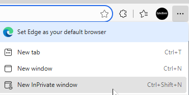
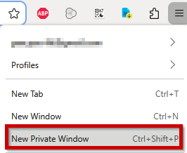
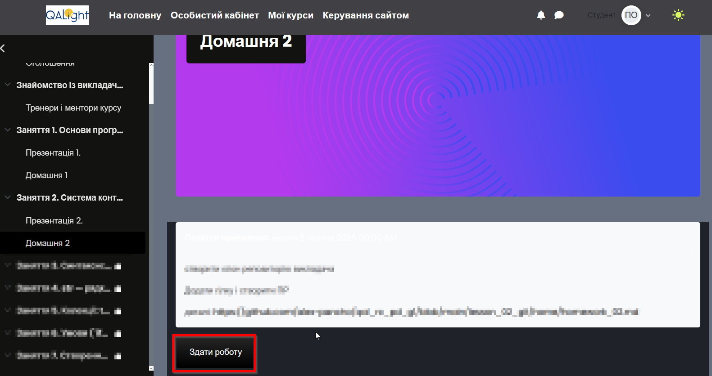
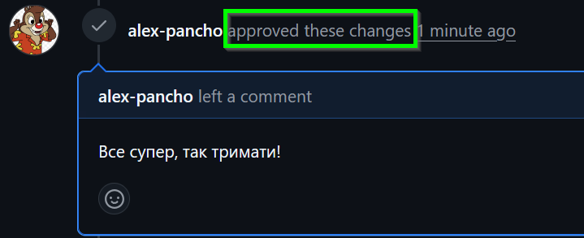

# Завдання для вивчення Git:

1. Створіть форк від репозиторію викладача на [github](https://github.com/)ю Це буде ваш робочий репозиторій.
2. Завантажте клон свого репозиторію за допомогою команди `git clone https://link.to.repo`, виконавши її у терміналі або командному рядку.
3. Перейдіть до гілки main за допомогою команди `git checkout main`.
4. Створіть нову гілку, яка буде використовуватись для змін, за допомогою команди `git checkout -b homework2`. Можна також використовувати формат: назва_дз_номер_лекції.
5. Знайдіть у вашому комп’ютері файл homework_01.py - це домашнє завдання, що ви виконували першим.
6. Перемістіть файл у репозиторій, створіть папку `lesson_01`  та помістіть файл у папці.
7. Додайте внесені зміни до стейджингу за допомогою команди `git add lesson_01/homework_01.py`
8. Зробіть коміт з змінами, додавши опис виконаних змін за допомогою команди `git commit -m "Виконані зміни"`.
9. Відправте свої зміни до вашого форку репозиторію за допомогою команди `git push`.
10. Переконайтеся, що зміни внесені у правильній гілці і що всі необхідні файли є, а зайвих немає
    
11. Створіть pull request у ваш репозиторій та у власну гілку `main` на головний репозиторію [https://github.com](https://github.com/), натиснувши кнопку "New pull request" на відповідному розділі репозиторію.
    

    
12. Преконайтеся, що ПР видно в браузері в режимі "інкогніто" або "Анонімний режим"
    

    
13. **Посилання на PR вставите у форму відповіді для ДЗ в навчальній системі:**

    
14. Після перевірки вашого pull request викладач може підтвердити, що все добре:
    

    
15. Або вказати помилки та запропонувати змінити щось
    

    
16. Після отримання Approved гілку можна замержити у `main`
