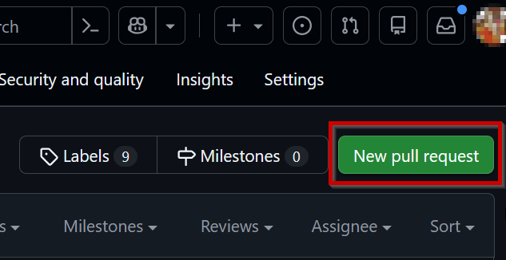
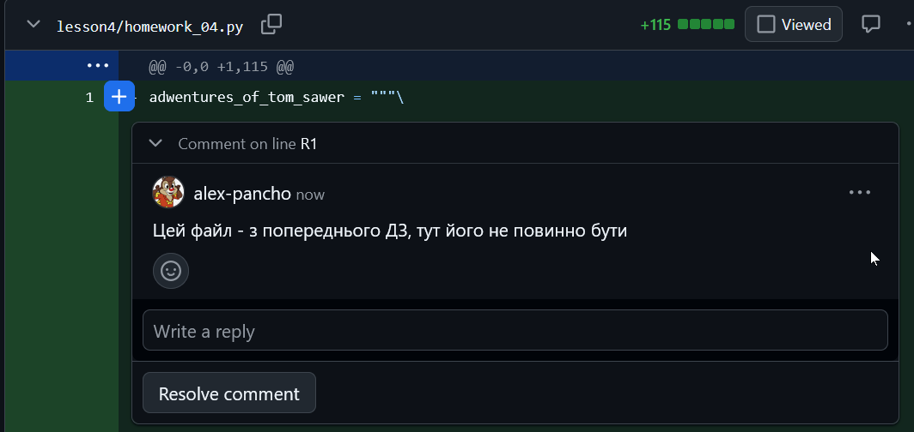

# Домашня робота: інструкції до виконання

1. Створіть нову гілку, яка буде використовуватись для змін, за допомогою команди `git checkout -b homework03`.
2. Завантажте файл [homework_03.py] та виконайте ДЗ згідно з інструкціями написаними в коментарях до коду.
3. Перемістіть файл у репозиторій, створіть папку `lesson_03`  та помістіть файл у папці.
4. Додайте внесені зміни до стейджингу за допомогою команди `git add lesson_03/homework_03.py`
8. Зробіть коміт з змінами, додавши опис виконаних змін за допомогою команди `git commit -m "Виконані зміни"`.
9. Відправте свої зміни до вашого форку репозиторію за допомогою команди `git push`.
11. Створіть pull request у  власну гілку `main`, натиснувши кнопку "New pull request" на відповідному розділі репозиторію.

12. Переконайтеся, що зміни внесені у правильній гілці і що всі необхідні файли є, а зайвих немає
13. **Посилання на PR вставите у форму відповіді для ДЗ в навчальній системі**
14. Після перевірки вашого pull request викладач може підтвердити, що все добре (Approved).

15. Або вказати помилки та запропонувати змінити щось

16. Після отримання Approved гілку можна замержити у `main`